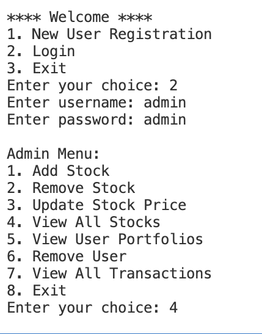

# 📈 Stock Portfolio Tracker

  
*Main menu interface of the application*

A console-based stock portfolio management system with admin/user roles, built with Python.

## 🌟 Features

### Admin Features
- 🛠️ Add/remove stocks
- 📊 Update stock prices
- 👥 View all user portfolios
- 📜 View transaction history

### User Features
- 💰 Buy/sell stocks
- 📊 View portfolio with profit/loss calculations
- 🕰️ Transaction history
- 📈 Portfolio performance summary

## 🛠️ Technologies Used

- Python 3
- `tabulate` for beautiful console tables
- File-based data persistence
- OOP principles

## 📦 Installation

1. Clone the repository:
   ```bash
   git clone https://github.com/yourusername/stock-portfolio-tracker.git
   cd stock-portfolio-tracker

2. Install dependencies:
   bash
   pip install -r requirements.txt

3. Run the application:
   bash
   python main.py

🖥️ Usage

## First Run

Initial setup screen

Register as a new user or login as admin:
Default admin credentials: admin/admin
Admin Panel

## Admin Menu
Admin management interface

Manage stocks and view all transactions
User Interface

## User Portfolio
User portfolio view with profit/loss

Buy/sell stocks and track your investments


## 🚀 Future Enhancements

- Real-time stock price integration
- Graphical portfolio visualization
- Email notifications
- Multi-user support

## 🤝 Contributing

- Fork the project
- Create your feature branch (git checkout -b feature/AmazingFeature)
- Commit your changes (git commit -m 'Add some AmazingFeature')
- Push to the branch (git push origin feature/AmazingFeature)
- Open a Pull Request

## 📝 License

Distributed under the MIT License. See LICENSE for more information.

<div align="center">
    Made with ❤️ and Python
</div>
